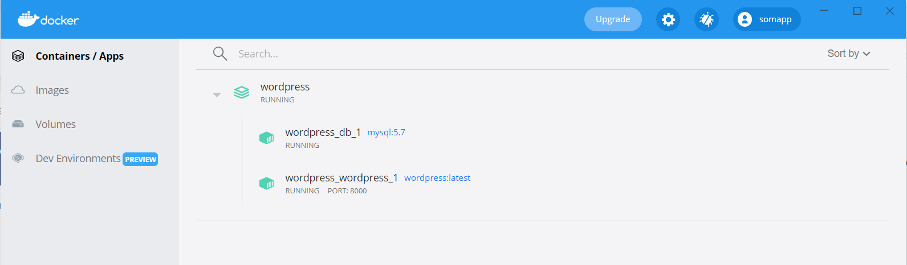

# SoftwareDeployment

## Part 1

According to [this](https://docs.docker.com/samples/wordpress/) tutorial 
- Created a project directory 
- Created the docker-compose.yml file
- Run project from the directory with the following script:
```
docker-compose up -d
```

