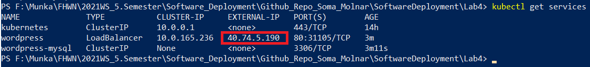
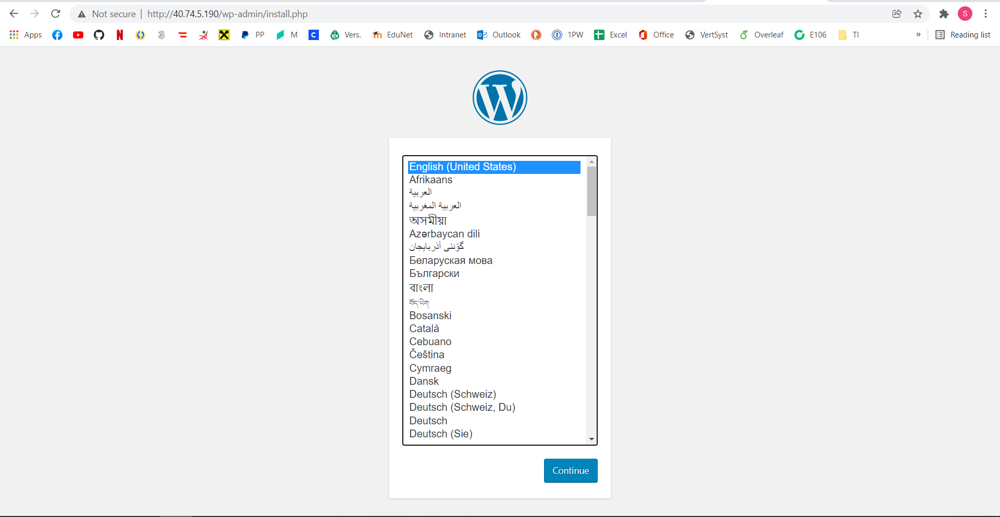
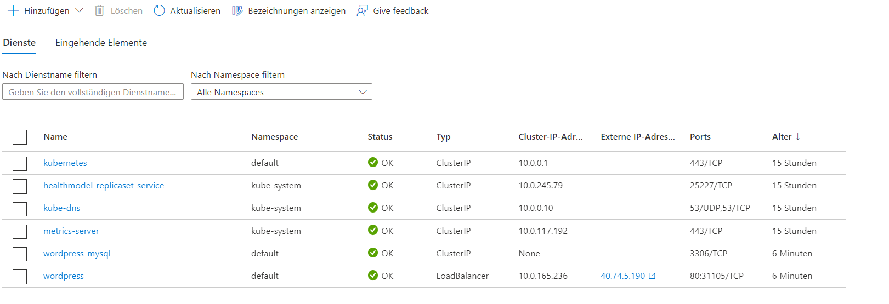

# Software Deployment

## External IP:
```
http://40.74.5.190/
```
## Lab 4


1. First of all we need to login into the azure account using the following command
```
az login
```


2. The next step is to create a Kubernetes-Service. I did that via the UI of Azure as it was shown 
in the online class.

3. Getting the credentials of the Kubernetes via:
```
az aks get-credentials -g 'Resourcegroup_Name' -n 'Kubernetes_Service_Name'
az aks get-credentials -g SD_Kubernetes -n MyKubernetes
```

4. Next we need to to generate a secret for the mysql
```
kubectl create secret generic mysql-pass --from-literal=password=123456789
```

5. Next step to set the subscription. In my case I used my Student-Subscription

```
az account set --subscription 'Subscription-ID'
```

6. Reloading the credentials 

```
az aks get-credentials -g 'Resourcegroup_Name' -n 'Kubernetes_Service_Name'
az aks get-credentials -g SD_Kubernetes -n MyKubernetes
```

7. Next step to configure 2 deployment yaml files. One for the Wordpress and one for the MySql

8. After that we need to apply/execute these files via 

```
kubectl apply -f .\mysql-deployment.yaml
kubectl apply -f .\wordpress-deployment.yaml
```

9. We can get the running services with the following command

```
kubectl get services
```


With this IP we can access the Wordpress application whether the Kubernetes Cluster is running 






Here we can see that all the services of the kubernetes service is running
